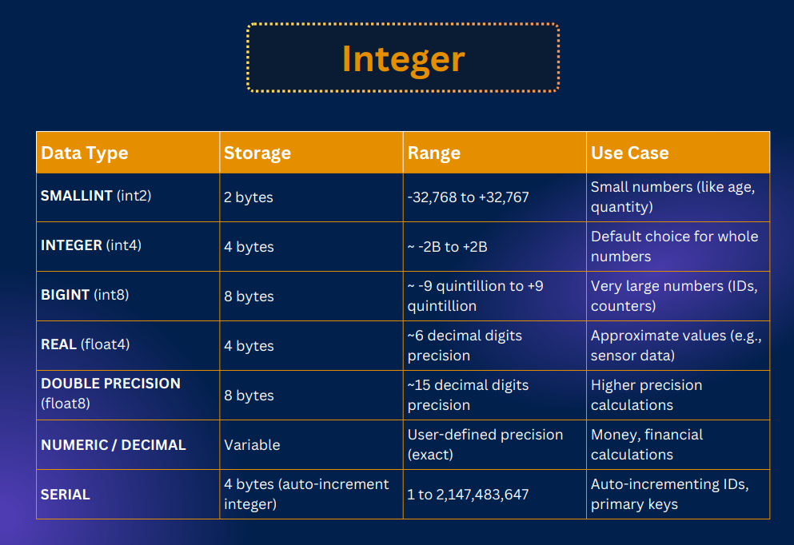
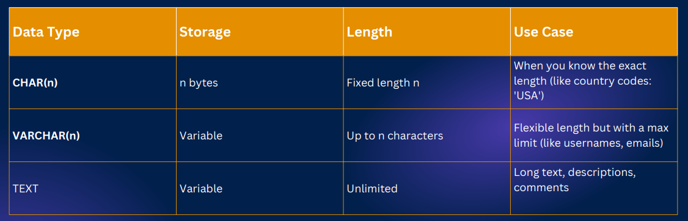
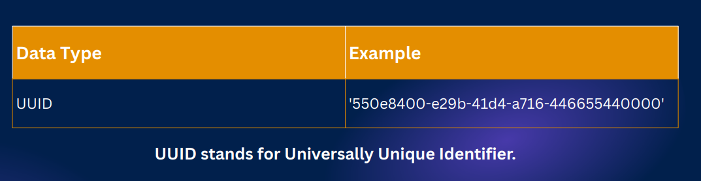
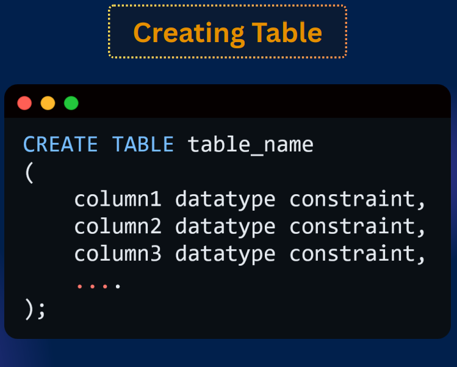
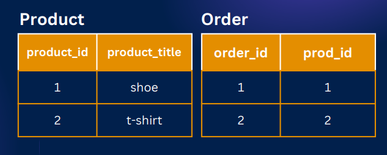
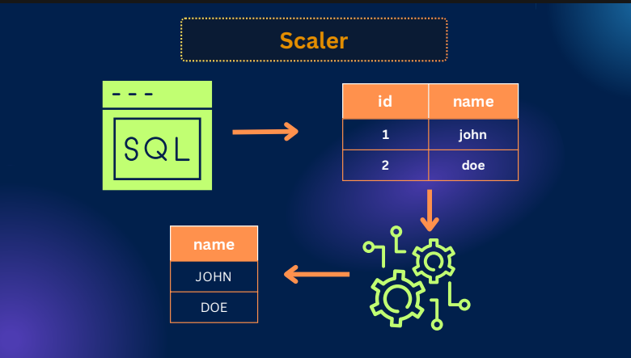
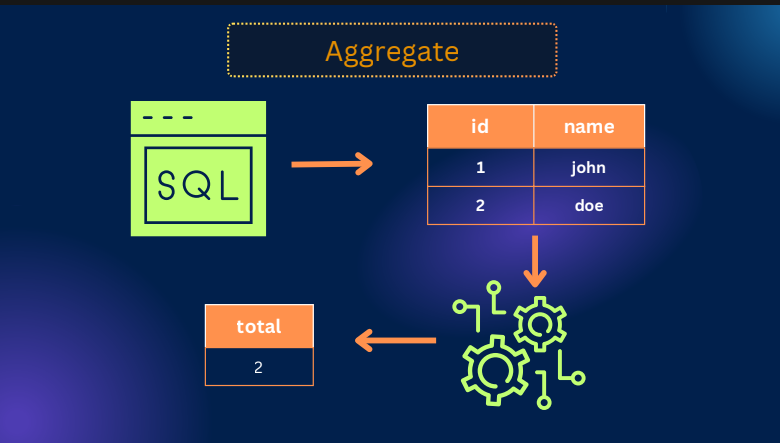

<h1 align="center">PostgreSQL Notes</h1>

- [Introduction](#introduction)
		- [Data Types:](#data-types)
		- [Create and Drop DB/table:](#create-and-drop-dbtable)
		- [column constraints:](#column-constraints)
		- [data insert to table:](#data-insert-to-table)
		- [Alter:](#alter)
		- [SELECT:](#select)
			- [Scalar Function:](#scalar-function)
			- [Aggregate Function:](#aggregate-function)
		- [Limit, Offset pagination:](#limit-offset-pagination)
		- [Practice questions:](#practice-questions)

# Introduction
PostgreSQL is an open-source, object-relational database management system (ORDBMS).

### Data Types: 
- Integer: 


- Boolean: true, false, null

- Character: 



- Date:


- UUID:



### Create and Drop DB/table:

- Create and delete DB: 

```sql
create database univercity
drop database univercity
```
- create and delete table:



```sql
create table students (
	id serial,
	name varchar(50),
	age int,
	isActive boolean,
	dob date
)

-- drop table students
drop table if exists students
```

### column constraints:

- NOT NULL

```sql
CREATE TABLE example (
    name VARCHAR(50) NOT NULL
)
```

- UNIQUE:

```sql
CREATE TABLE example (
    email VARCHAR(100) UNIQUE
)
```

- PRIMARY KEY:

```sql
CREATE TABLE example (
    student_id SERIAL PRIMARY KEY,
)
```

- Foreign key:

```sql
CREATE TABLE example (
    order_id SERIAL PRIMARY KEY,
    product_id INTEGER REFERENCES product(product_id)
)
```


- DEFAULT:
  
```sql
CREATE TABLE example (
    status VARCHAR(20) DEFAULT 'active'
)
```

- CHECK


```sql
CREATE TABLE example (
    age INT CHECK (age >= 18) 
)
```

example: 

```sql
create table students(
	student_id SERIAL PRIMARY KEY,
	full_name VARCHAR(100) NOT NULL,
	email VARCHAR(100) UNIQUE,
	age INT CHECK (age >= 18),
	status VARCHAR(20) DEFAULT 'active'
)
```

```sql
CREATE TABLE students (
    student_id SERIAL,
    username VARCHAR(100) NOT NULL,
    email VARCHAR(100),
    age INT CHECK (age >= 18),
    status VARCHAR(20) DEFAULT 'active',

    PRIMARY KEY (student_id),
    UNIQUE (username, email)
);
```

### data insert to table:

- single row insert: 

```sql
CREATE TABLE person (
	id SERIAL PRIMARY KEY,
	username VARCHAR(50) UNIQUE,
	email VARCHAR(50) UNIQUE,
	age INT CHECK (age >= 20),
	isActive BOOLEAN DEFAULT true
);

INSERT INTO person (username, email, age)
VALUES ('tamim', 'tamim@gmail.com', 28);
```

- multi row insert:

```sql
INSERT INTO person (username, email, age)
VALUES
    ('alice', 'alice@gmail.com', 24),
    ('bob', 'bob@gmail.com', 30),
    ('charlie', 'charlie@gmail.com', 22);
```

### Alter:


```sql
CREATE TABLE stu(
	id SERIAL,
	name VARCHAR(30),
	email TEXT,
	age INT,
	status TEXT
)
```

- Rename table:

```sql
ALTER TABLE stu RENAME to students
```

- add a table level constrains:

```sql
ALTER TABLE students ADD CONSTRAINT unique_students_email UNIQUE (email)
```

```sql
ALTER TABLE students ADD CONSTRAINT primary_students_id PRIMARY KEY (id)
```

- add column: 

```sql
ALTER TABLE students ADD COLUMN isMarid BOOLEAN
```

- drop Column: 

```sql
ALTER TABLE students DROP COLUMN isMarid
```

- Rename a column: 

```sql
ALTER TABLE students RENAME COLUMN name TO username
```

- Modify a constrains: 

```sql
ALTER TABLE students ALTER COLUMN username TYPE VARCHAR(50) 
```

- add a constrains: 

```sql
ALTER TABLE students ALTER COLUMN email SET NOT NULL
```

```sql
ALTER TABLE students ALTER COLUMN status SET DEFAULT 'active'
```

- drop a constrains: 

```sql
ALTER TABLE students ALTER COLUMN email DROP NOT NULL
```

### SELECT:


 ```sql
 CREATE TABLE students (
	student_id SERIAL PRIMARY KEY,
	first_name VARCHAR(50) NOT NULL,
	last_name VARCHAR(50) NOT NULL,
	age INT,
	grade CHAR(2),
	course VARCHAR(50),
	email VARCHAR(20) UNIQUE,
	dob DATE,
	blood_group VARCHAR(5),
	country VARCHAR(50)
)
 ```

```sql
INSERT INTO students
(first_name, last_name, age, grade, course, email, dob, blood_group, country)
VALUES
('Tamim', 'Islam', 22, 'A',  'Computer Science',        'tamim@gmail.com',     '2003-05-12', 'O+',  'Bangladesh'),
('Ayesha', 'Rahman', 21, 'A+', 'Software Engineering', 'ayesha@gmail.com',    '2004-02-18', 'A+',  'Bangladesh'),
('Rahul', 'Sharma', 23, 'B+', 'Information Technology','rahul@gmail.com',     '2002-09-30', 'B+',  'India'),
('Sara', 'Khan', 20, 'A',  'Data Science',             'sara@gmail.com',      '2005-01-10', 'AB+', 'Pakistan'),
('John', 'Doe', 24, 'B',  'Computer Engineering',     'john@gmail.com',      '2001-07-25', 'O-',  'USA'),

('Hasan', 'Ali', 22, 'A-', 'Cyber Security',           'hasan@gmail.com',     '2003-03-14', 'B+',  'Bangladesh'),
('Nabila', 'Hossain', 21, 'A', 'Computer Science',    'nabila@gmail.com',    '2004-06-02', 'O+',  'Bangladesh'),
('Arif', 'Ahmed', 23, 'B', 'Information Systems',     'arif@gmail.com',      '2002-11-19', 'A-',  'Bangladesh'),
('Priya', 'Verma', 22, 'A+', 'Software Engineering',  'priya@gmail.com',     '2003-01-08', 'B+',  'India'),
('Rohit', 'Kumar', 24, 'C+', 'Computer Science',      'rohit@gmail.com',     '2001-12-15', 'O+',  'India'),

('Fatima', 'Noor', 20, 'A', 'Data Analytics',          'fatima@gmail.com',    '2005-04-22', 'AB-', 'Pakistan'),
('Imran', 'Sheikh', 23, 'B+', 'Computer Engineering', 'imran@gmail.com',     '2002-08-05', 'O+',  'Pakistan'),
('Zara', 'Malik', 21, 'A+', 'Artificial Intelligence','zara@gmail.com',      '2004-09-11', 'A+',  'UK'),
('Daniel', 'Smith', 25, 'B', 'Information Technology','daniel@gmail.com',    '2000-02-27', 'O-',  'USA'),
('Emily', 'Brown', 22, 'A', 'Data Science',            'emily@gmail.com',     '2003-10-03', 'B-',  'USA'),

('Michael', 'Johnson', 24, 'C', 'Computer Science',   'michael@gmail.com',   '2001-01-19', 'A+',  'USA'),
('Sophia', 'Wilson', 21, 'A+', 'Software Engineering','sophia@gmail.com',    '2004-07-07', 'O+',  'Canada'),
('Liam', 'Martin', 23, 'B+', 'Cloud Computing',       'liam@gmail.com',      '2002-05-28', 'AB+', 'Canada'),
('Olivia', 'Taylor', 22, 'A', 'Cyber Security',       'olivia@gmail.com',    '2003-03-09', 'O-',  'Canada'),
('Noah', 'Anderson', 24, 'B', 'Information Systems',  'noah@gmail.com',      '2001-06-17', 'B+',  'Australia'),

('Ethan', 'Thomas', 23, 'A-', 'Computer Engineering','ethan@gmail.com',      '2002-12-01', 'O+',  'Australia'),
('Mia', 'Moore', 21, 'A+', 'Data Science',             'mia@gmail.com',       '2004-04-14', 'A-',  'Australia'),
('Lucas', 'Jackson', 22, 'B+', 'Software Engineering','lucas@gmail.com',     '2003-08-21', 'AB+', 'Germany'),
('Amelia', 'White', 20, 'A', 'Artificial Intelligence','amelia@gmail.com',   '2005-09-02', 'O+',  'Germany'),
('Benjamin', 'Harris', 25, 'C+', 'Computer Science', 'benjamin@gmail.com',   '2000-11-11', 'B-',  'Germany'),

('Henry', 'Clark', 24, 'B', 'Information Technology', 'henry@gmail.com',     '2001-02-06', 'O-',  'France'),
('Ella', 'Lewis', 22, 'A+', 'Software Engineering',  'ella@gmail.com',       '2003-06-30', 'A+',  'France'),
('Jack', 'Walker', 23, 'B+', 'Cyber Security',        'jack@gmail.com',       '2002-10-18', 'AB-', 'France'),
('Grace', 'Hall', 21, 'A', 'Data Science',             'grace@gmail.com',     '2004-01-26', 'O+',  'France');
```

- SELECT: 

use * to get all of data:
```sql
select * from students 
```

use specific column name to see specific data:

```sql
select first_name, age from students 
```

- alias: 

```sql
select first_name as "First Name", age as user_age from students 
```

- Sorting:

```sql
SELECT * FROM students ORDER BY age DESC 
```

```sql
SELECT * FROM students ORDER BY age ASC
```

- Distinct: 

Get unique countries:

```sql
SELECT DISTINCT country FROM students 
```

- filtering:

filtering with =:

```sql
SELECT * FROM students WHERE country = 'USA'
```

```sql
SELECT first_name, age, course, country FROM students WHERE country = 'USA'
```

filtering with and: 

```sql
SELECT * FROM students WHERE country = 'USA' or country = 'UK'
```

filtering with and:

```sql
SELECT * FROM students WHERE (grade = 'A' or grade = 'B') and (course = 'Computer Science' or course = 'Computer Engineering')
```

```sql
SELECT * FROM students WHERE (country = 'USA' or grade = 'UK') and age = 22 
```

filtering with comparison operator: 

```sql
SELECT * FROM students WHERE age >= 20
```

```sql
SELECT * FROM students WHERE country != 'USA'
-- != or <>
```

filtering with between:

```sql
SELECT * FROM students WHERE age between 20 and 22
-- age >= 20 && age <= 22
```

filtering with in: 

```sql
-- SELECT * FROM students WHERE country = 'USA' or country = 'UK' or country = 'Bangladesh'

SELECT * FROM students WHERE country in ('USA', 'UK', 'Bangladesh')
```

- Like: 

```sql
SELECT * FROM students WHERE first_name like 'A%'
-- first letter will be A
```

```sql
SELECT * FROM students WHERE first_name like '%a'
-- Last letter will be a
```

```sql
SELECT * FROM students WHERE first_name like '%a___'
-- start with a and max 3 letter after a Tamim
```

- ILike: 

same as like but case insensitive

```sql
SELECT * FROM students WHERE email ILIKE 'A%'
```

- NOT: 

```sql
SELECT * FROM students WHERE NOT country = 'Bangladesh'
```

#### Scalar Function: 



- upper, lower, concat, length

```sql
SELECT UPPER(first_name) as first_name_upper, first_name FROM students
```

```sql
SELECT LOWER(first_name) as first_name_upper, first_name FROM students
```

```sql
SELECT CONCAT(first_name, last_name) as full_name, first_name FROM students
```

#### Aggregate Function: 



- avg, min, max, sum, count 

```sql
SELECT AVG(age) as avg_age FROM students
```

```sql
SELECT MAX(age) FROM students
```

```sql
SELECT COUNT(first_name) FROM students
-- or
-- SELECT COUNT(*) FROM students
```


### Limit, Offset pagination:

```sql
select * from customers limit 5
```

```sql
select * from customers limit 5 offset 2
-- here offset removes first 2 data
```

pagination:

```sql
select * from customers limit 5 offset 5 * 0
select * from customers limit 5 offset 5 * 1
select * from customers limit 5 offset 5 * 2
```

### Update and delete data: 

Update: 

```sql
UPDATE customers SET email = 'default@mail.com' WHERE email IS null
```
```sql
UPDATE customers SET customer_first_name = 'yoyo', email = 'youo@gmail.com' WHERE customer_id = 1
```

Delete:

```sql
DELETE FROM customers WHERE customer_first_name = 'yoyo'
```

### GROUP BY:

```sql
SELECT country from customers group by country
```

```sql
SELECT grade, count(*) FROM students GROUP BY grade
```

With having: 

```sql
SELECT course, count(*) FROM students GROUP BY course HAVING count(*) > 4
```

```sql
SELECT country, avg(age) FROM students GROUP BY country HAVING AVG(age) > 21 
```

### Foreign key: 

```sql
CREATE TABLE users (
	id SERIAL PRIMARY KEY,
	username VARCHAR(25) NOT NULL
)
```

```sql
CREATE TABLE POSTS (
	id SERIAL PRIMARY KEY,
	title TEXT NOT NULL,
	user_id INT REFERENCES "users"(id)
)
```

```sql
INSERT INTO users (username) 
VALUES ('tamim'), ('gamim'), ('samim'), ('lamim'), ('halim')
```

```sql
INSERT INTO posts (title, user_id) 
VALUES 
	('Enjoying a sunny day with akash!', 2),
	('Batash just shared an amazing recipe', 1),
	('Exploring adventures with sagor', 4),
	('Nodi, wisdom always leaves me inspire', 4)
```

### Inner Join:

```sql
SELECT title, username FROM posts JOIN users ON posts.user_id = users.id
```

```sql
SELECT * FROM posts JOIN users ON posts.user_id = users.id
```


### Practice questions:

#### Part 1:

https://github.com/Apollo-Level2-Web-Dev/postgreSQL_query_task

- create table

```sql
CREATE TABLE customers (
	customer_id SERIAL PRIMARY KEY,
	first_name VARCHAR(50),
	last_name VARCHAR(50),
	email VARCHAR(100) UNIQUE,
	city VARCHAR(50),
	country VARCHAR(50),
	registration_date DATE
)


CREATE TABLE books (
	book_id SERIhttps://github.com/Apollo-Level2-Web-Dev/postgreSQL_query_taskAL PRIMARY KEY,
	title VARCHAR(200),
	author VARCHAR(100),
	genre VARCHAR(50),
	price DECIMAL(10, 2),
	publication_year SMALLINT,
	stock_quantity SMALLINT
)


CREATE TABLE orders (
	order_id SERIAL PRIMARY KEY,
	customer_id INT REFERENCES customers(customer_id) ON DELETE CASCADE,
	book_id INT REFERENCES books(book_id) ON DELETE CASCADE,
	order_date DATE,
	quantity SMALLINT,
	total_amount DECIMAL(10, 2)
)
```

- Insert data

```sql
INSERT INTO customers (first_name, last_name, email, city, country, registration_date)
VALUES
('John', 'Smith', 'john.smith@email.com', 'New York', 'USA', '2023-01-15'),
('Emma', 'Johnson', 'emma.j@email.com', 'London', 'UK', '2023-02-20'),
('Michael', 'Brown', 'mbrown@email.com', 'Toronto', 'Canada', '2023-01-10'),
('Sophia', 'Davis', 'sophia.d@email.com', 'Sydney', 'Australia', '2023-03-05'),
('James', 'Wilson', 'jwilson@email.com', 'New York', 'USA', '2023-02-28'),
('Oliver', 'Taylor', 'oliver.t@email.com', 'London', 'UK', '2023-04-12'),
('Ava', 'Anderson', 'ava.anderson@email.com', 'Los Angeles', 'USA', '2023-03-18'),
('William', 'Martinez', 'w.martinez@email.com', 'Madrid', 'Spain', '2023-01-25'),
('Isabella', 'Garcia', 'isabella.g@email.com', 'Mexico City', 'Mexico', '2023-02-14'),
('Lucas', 'Rodriguez', 'lucas.r@email.com', 'Buenos Aires', 'Argentina', '2023-03-30');
```

```sql
INSERT INTO books (title, author, genre, price, publication_year, stock_quantity)
VALUES
('The Great Gatsby', 'F. Scott Fitzgerald', 'Fiction', 12.99, 1925, 45),
('To Kill a Mockingbird', 'Harper Lee', 'Fiction', 14.99, 1960, 32),
('1984', 'George Orwell', 'Science Fiction', 13.99, 1949, 28),
('Pride and Prejudice', 'Jane Austen', 'Romance', 11.99, 1813, 50),
('The Catcher in the Rye', 'J.D. Salinger', 'Fiction', 12.99, 1951, 22),
('Harry Potter and the Sorcerer Stone', 'J.K. Rowling', 'Fantasy', 19.99, 1997, 60),
('The Hobbit', 'J.R.R. Tolkien', 'Fantasy', 15.99, 1937, 38),
('Brave New World', 'Aldous Huxley', 'Science Fiction', 13.99, 1932, 25),
('The Lord of the Rings', 'J.R.R. Tolkien', 'Fantasy', 29.99, 1954, 41),
('Animal Farm', 'George Orwell', 'Fiction', 10.99, 1945, 55),
('Fahrenheit 451', 'Ray Bradbury', 'Science Fiction', 12.99, 1953, 30),
('The Great Adventure', 'John Anderson', 'Fiction', 16.99, 2020, 18),
('Mystery in Paris', 'Marie Dubois', 'Mystery', 14.99, 2019, 27),
('Romance in Rome', 'Isabella Rossi', 'Romance', 13.99, 2021, 35);
```

```sql
INSERT INTO orders (customer_id, book_id, order_date, quantity, total_amount)
VALUES
(1, 1, '2023-05-10', 2, 25.98),
(1, 6, '2023-05-15', 1, 19.99),
(2, 3, '2023-05-12', 1, 13.99),
(3, 2, '2023-05-11', 3, 44.97),
(4, 7, '2023-05-13', 1, 15.99),
(5, 9, '2023-05-14', 2, 59.98),
(2, 4, '2023-05-16', 1, 11.99),
(6, 6, '2023-05-17', 2, 39.98),
(7, 1, '2023-05-18', 1, 12.99),
(8, 8, '2023-05-19', 1, 13.99),
(1, 10, '2023-06-01', 2, 21.98),
(3, 5, '2023-06-02', 1, 12.99),
(9, 11, '2023-06-03', 3, 38.97),
(10, 12, '2023-06-04', 1, 16.99),
(4, 13, '2023-06-05', 2, 29.98),
(5, 14, '2023-06-06', 1, 13.99),
(2, 6, '2023-06-07', 1, 19.99),
(7, 3, '2023-06-08', 2, 27.98);
```

Solutions: 
- Display all books with their titles and prices, ordered by price (lowest to highest)

```sql
SELECT title, price FROM books ORDER BY price ASC 
```

- Find all distinct countries where customers are from

```sql
SELECT DISTINCT country FROM customers
```

- Find all books whose titles start with "The"

```sql
SELECT * FROM books WHERE title like 'The%'
```
- Change the column name first_name to customer_first_name in the customers table

```sql
ALTER TABLE customers RENAME COLUMN first_name to customer_first_name
```
- Find all books in the Fantasy genre

```sql
SELECT * FROM books WHERE genre = 'Fantasy'
```
- Count the total number of orders in the database

```sql
SELECT COUNT(*) FROM orders
```
- Find the average price of books by genre, but only show genres with an average price greater than $14

```sql
SELECT genre, AVG(price) AS avg_price FROM books GROUP BY genre HAVING AVG(price) > 14;
```
- Find all customers whose email addresses end with .com and are from either USA or UK

```sql
SELECT * FROM customers WHERE email LIKE '%.com' AND country = 'USA' OR country = 'UK'
```
- Display all customers with their full name in uppercase (concatenated first and last name), original email, and city in lowercase. Only show customers from USA or UK.

```sql
SELECT 
    UPPER(first_name, ' ', last_name) AS full_name_upper,
    LOWER(email) AS email_lower,
    LOWER(city) AS city_lower
FROM customers
WHERE country IN ('USA', 'UK');
```

- Find the total revenue, average order amount, maximum order amount, and minimum order amount from all orders placed in June 2023.

```sql
SELECT 
	SUM(total_amount) as revenue, 
	AVG(total_amount) as average_order_amount,
	MAX(total_amount) as maximum_order_amount,
	MIN(total_amount) as min_order_amount
from orders WHERE order_date >= '2023-06-01' AND order_date <= '2023-06-30';
```

#### part 2:

```sql
CREATE TABLE employees(
  employee_id SERIAL PRIMARY KEY,
  employee_name VARCHAR(50),
  department_id INT REFERENCES departments (department_id),
  salary DECIMAL(10, 2),
  hire_date DATE
);

CREATE TABLE departments(
  department_id SERIAL PRIMARY KEY,
  department_name VARCHAR(50)
)

INSERT INTO departments (department_name)
VALUES ('HR'), ('Marketing'), ('Finance'), ('IT'), ('Sales'), ('Engineering'), ('Customer Support'), ('Administration'), ('Research'), ('QA')

INSERT INTO employees (employee_name, department_id, salary, hire_date)
VALUES 
('Alice Johnson', 1, 45000.00, '2021-03-15'),      -- HR
('Bob Smith', 2, 52000.00, '2020-07-10'),          -- Marketing
('Charlie Brown', 3, 60000.00, '2019-01-20'),      -- Finance
('David Wilson', 4, 75000.00, '2018-09-05'),       -- IT
('Eva Green', 5, 48000.00, '2022-02-18'),          -- Sales
('Frank Miller', 6, 82000.00, '2017-11-30'),       -- Engineering
('Grace Lee', 7, 40000.00, '2023-04-12'),          -- Customer Support
('Henry Adams', 8, 43000.00, '2021-06-25'),        -- Administration
('Ivy Clark', 9, 68000.00, '2020-10-08'),          -- Research
('Jack Turner', 10, 55000.00, '2019-05-14'),       -- QA

('Karen White', 4, 72000.00, '2022-08-01'),        -- IT
('Leo Martin', 6, 90000.00, '2016-12-19'),         -- Engineering
('Mia Scott', 5, 51000.00, '2021-01-07'),          -- Sales
('Noah Harris', 2, 58000.00, '2020-03-22'),        -- Marketing
('Olivia Young', 1, 47000.00, '2023-01-10');       -- HR

-- 1. Inner join to retrieve employee and department information

-- SELECT * FROM employees AS e INNER JOIN departments AS d on e.employee_id = d.department_id
SELECT * FROM employees INNER JOIN departments USING(department_id)

-- 2. Show department name with average salary
SELECT department_name, ROUND(AVG(salary)) FROM employees 
  INNER JOIN departments USING(department_id) GROUP BY department_name

-- 3. Count employee in each department
SELECT department_name, COUNT(*) FROM employees 
  INNER JOIN departments USING(department_id) GROUP BY department_name

-- 4. Find the department name with the highest average salary
SELECT department_name, ROUND(AVG(salary)) AS avg_salary FROM employees 
  INNER JOIN departments USING(department_id) GROUP BY department_name ORDER BY avg_salary DESC LIMIT 1

-- 5. Count employees hired each year:
SELECT EXTRACT(year from hire_date) AS hired_year, COUNT(*) FROM employees GROUP BY hired_year
```

### Subquery:

```sql
CREATE TABLE employees (
  id SERIAL PRIMARY KEY,
  name VARCHAR(50),
  department VARCHAR(50),
  salary INT
)

INSERT INTO employees (name, department, salary) 
VALUES
  ('Tamim', 'IT', 50000),
  ('Gamim', 'HR', 40000),
  ('Samim', 'IT', 60000),
  ('Lamim', 'Finance', 45000),
  ('Famim', 'HR', 35000)

-- Find the highest salary
SELECT MAX(salary) from employees

-- Find which employee gets the highest salary
SELECT * FROM employees WHERE salary = (SELECT MAX(salary) from employees)

-- Find employees who earn more than the average salary
SELECT * FROM employees WHERE salary > (SELECT AVG(salary) from employees)

-- Name of the employee who gets the highest salray in HR department
SELECT * FROM employees WHERE salary = (
  SELECT MAX(salary) FROM employees WHERE department = 'HR'
)
```

### Function: 

- With return:  

```sql
CREATE FUNCTION emp_count()
RETURNS INT
LANGUAGE SQL
AS 
$$
  SELECT COUNT(*) FROM employees
$$   
```
```sql
SELECT emp_count()
```

- No return:

```sql
CREATE FUNCTION delete_emp_id(emp_id INT)
RETURNS VOID
LANGUAGE SQL
AS 
$$
  DELETE FROM employees WHERE id = emp_id
$$
```

```sql
SELECT delete_emp_id(5)
```

### Procedure:

```sql
create procedure increase_low_salary(department_name varchar(50))
language plpgsql
as 
$$
  declare 
    avg_salary int;
  begin
    select avg(salary) into avg_salary from employees
    where department = department_name;

    update employees set salary = salary * 1.1
    where department = department_name and salary < avg_salary;
  end;
$$
```

```sql
call increase_low_salary('IT')
```

### Trigger:

```sql
create table employee_logs (
  id serial primary  key,
  emp_name varchar(100), 
  action varchar(25), 
  action_time timestamp default now()
)

create trigger save_employee_delete_logs
after delete
on employees
for each row
execute function log_employee_deletion();

create function log_employee_deletion()
returns trigger
language plpgsql
as 
$$
  begin
    insert into employee_logs (emp_name, action) values (old.name, 'delete');
    return old;
  end;
$$

select delete_emp_id(3)
```

###  indexing:

```sql
explain analyse
select * from users where email = 'test1@gmail.com'

create index idx_users_email on users (email)

explain analyse
select * from users where email = 'test1@gmail.com'
```