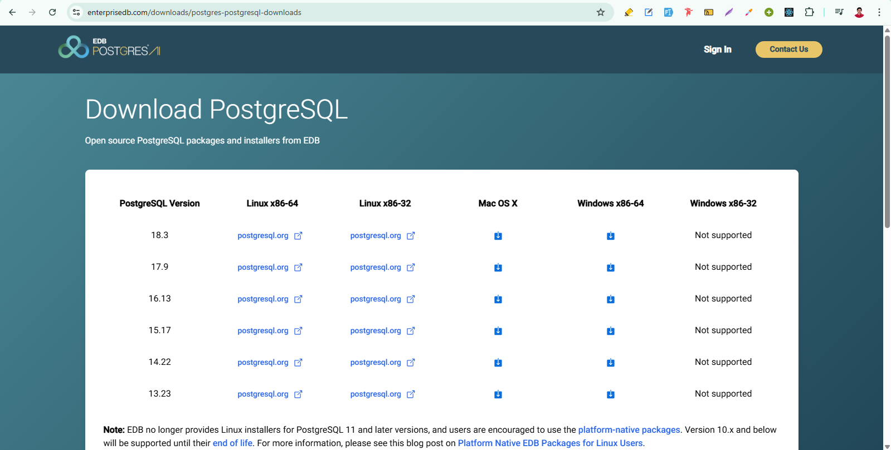
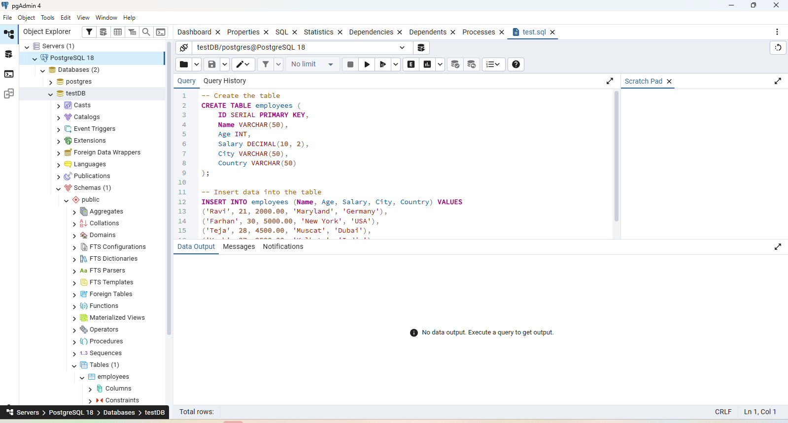
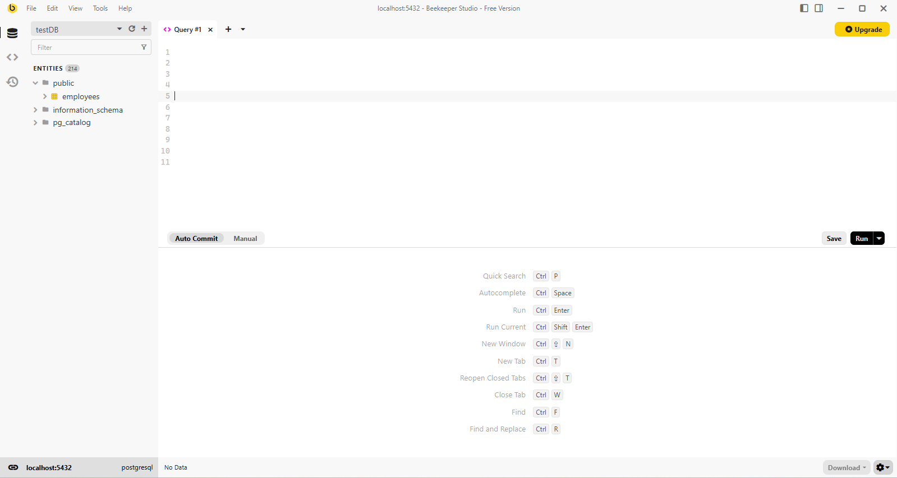

<h1 align="center">PostgreSQL Notes</h1>

- [Setup:](#setup)
- [Introduction:](#introduction)
	- [What is PostgreSQL:](#what-is-postgresql)
	- [Features of PostgreSQL:](#features-of-postgresql)
	- [What is ACID and BASE compliance:](#what-is-acid-and-base-compliance)
		- [ACID Compliance:](#acid-compliance)
		- [Base Compliance:](#base-compliance)
		- [Difference Between ACID and Base Compliance:](#difference-between-acid-and-base-compliance)
	- [PostgreSQL vs MySQL Vs MongoDB:](#postgresql-vs-mysql-vs-mongodb)

# Setup: 
- Step 1: Download postgres and install:

- Step 2: We can use postgres builtin GUI pgAdmin4 or Beekeeper Studio: 

Note: Beekeeper Studio if more preferable. 

# Introduction:
## What is PostgreSQL:
PostgreSQL (often called Postgres) is a relational database management system (RDBMS) that stores data in tables (rows and columns) format by using SQL (structure query language). 

## Features of PostgreSQL: 
- Relational Database with SQL + Advance SQL
- ACID Compliance
- Support complex relationships and queries
- Support both relational + JSON data
- Support Custom functions and data types
- Support Indexing (e.g. B-tree, Hash, GIN, GiST)

## What is ACID and BASE compliance: 
### ACID Compliance:  
ACID is a set of principles designed to ensure reliable and consistent database transactions. ACID stands for:
- Atomicity → A transaction is all or nothing (If one part fails, everything is rolled back)
- Consistency → Data always follows defined rules and constraints (e.g. schema)
- Isolation → Multiple transactions do not interfere with each other
- Durability → committed data is permanently saved (even after crashes)

### Base Compliance:
BASE is a set of principles designed for high availability and scalability in distributed systems. BASE stands for:
- Basically Available → System remains available even during failures
- Soft State → Data can change over time
- Eventually Consistent → Data will become consistent after some time

**Summary:**
- ACID: Focuses on strict consistency and data correctness
- BASE: Focuses on availability and scalability with eventual consistency

### Difference Between ACID and Base Compliance: 
| Feature        | ACID                              | BASE                                    |
| -------------- | --------------------------------- | --------------------------------------- |
| Consistency    | Strong (immediate)                | Eventual (delayed)                      |
| Availability   | Lower (can block for consistency) | High (always available)                 |
| Data Integrity | Strict                            | Relaxed                                 |
| Transactions   | Fully supported                   | Limited / weaker                        |
| Use Case       | Banking, payments, orders         | Social media, analytics, real-time apps |
| Database Type  | Relational (PostgreSQL, MySQL)    | NoSQL (MongoDB, Cassandra)              |

## PostgreSQL vs MySQL Vs MongoDB: 
| Feature        | PostgreSQL                     | MySQL                   | MongoDB                |
| -------------- | ------------------------------ | ----------------------- | ---------------------- |
| Type           | Relational (RDBMS)             | Relational (RDBMS)      | Document-based         |
| Schema         | Strict (but flexible via JSON) | Strict                  | Schema-less            |
| Query Language | SQL (advanced)                 | SQL (simpler)           | N/A                    |
| Transactions   | Full ACID support              | ACID (less advanced)    | Limited (improving)    |
| Relationships  | Strong (JOINs, FK)             | Supported               | Weak / manual          |
| JSON Support   | Yes (JSONB, powerful)          | Limited                 | Native                 |
| Performance    | Best for complex queries       | Fast for simple queries | Best for flexible data |